## 乡村 e 站

#### 前端

技术栈：uniapp、vue2

功能：

- 首页
- 文章列表
- 个人中心
- 商城
- 商品详情
- 购物车
- 提交订单
- 商品列表
- 收货地址
- 就业
- 管理员个人中心页
- 管理员商品列表

#### 后端

技术栈：jdk17 + springboot2.5.4
主要功能：

- 调用阿里短信接口
- 调用微信支付接口
- 调用阿里文本 图片审核接口
- 调用阿里 oss 上传接口
- 调用微信消息推送接口

本项目图片素材均来源于网络，仅供学习使用。

---

## 前端界面展示

### 首页展示

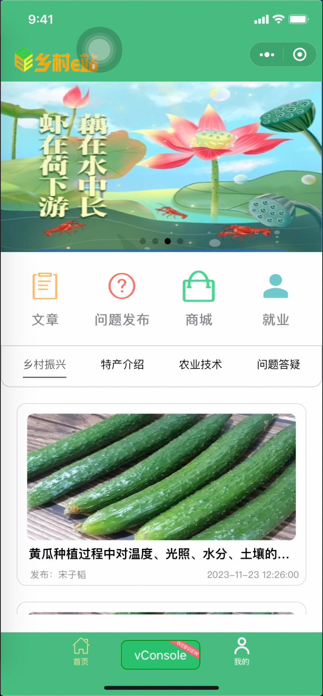

点击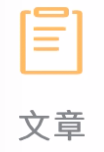进入文章页面

点击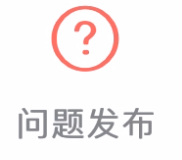进入问题发布页面

点击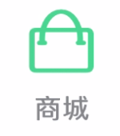进入商城页面

点击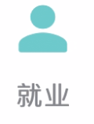进入就业页面

点击选项卡切换对应文章

点击文章卡片进入文章详情

点击菜单栏进入个人中心页面

### 文章列表展示

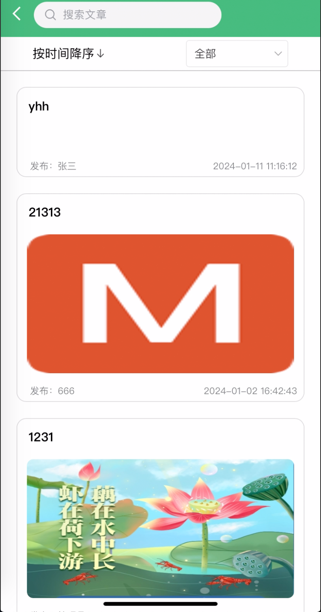

点击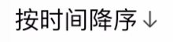切换文章按照时间排序

点击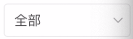选择查看类型

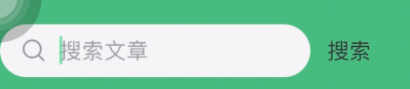

输入关键字点击搜索即可搜索相关内容

点击进入文章详情

### 个人中心展示

点击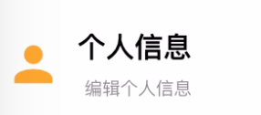查看、编辑个人信息

点击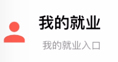查看、编辑我发布的招聘

点击查看、编辑我发布的问题及评论

点击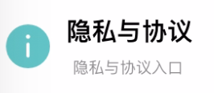查看用户协议与隐私政策

点击退出登陆

点击注销账号

### 商城展示

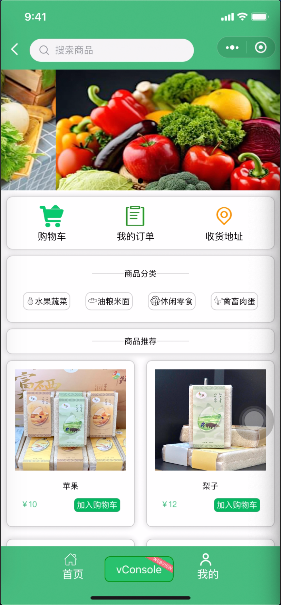

点击查看购物车列表

点击查看我的订单

点击查看商品详情

点击加入购物车

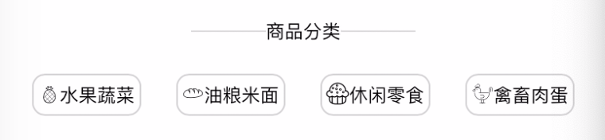

点击分类进入商品列表

### 商品详情展示

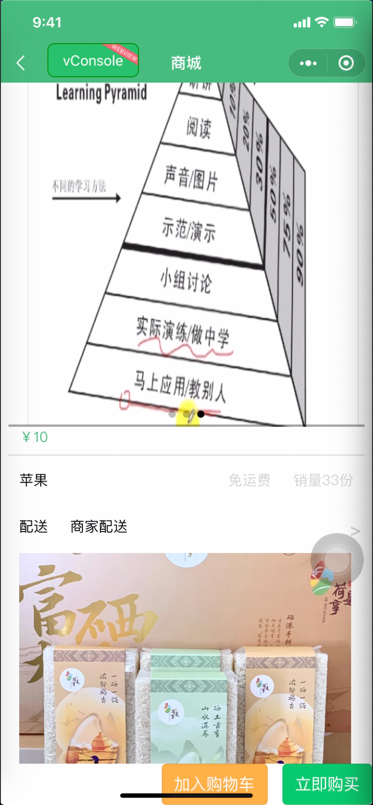

点击加入购物车

点击进入提交订单

### 购物车展示

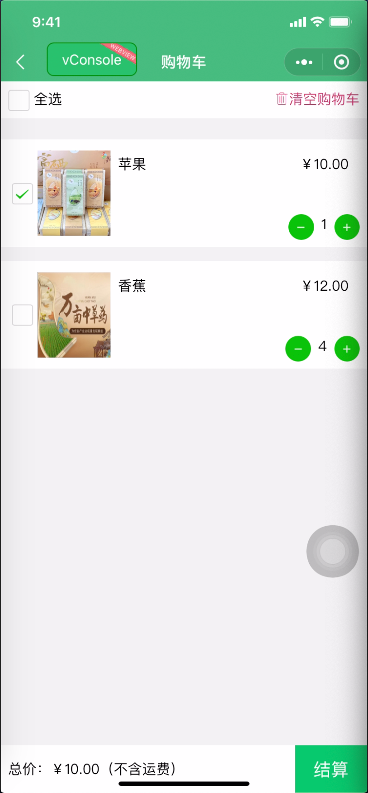

点击进入提交订单已勾选商品

点击清空购物车

点击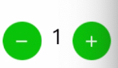改变购物车商品数量

点击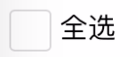全选商品

### 提交订单展示

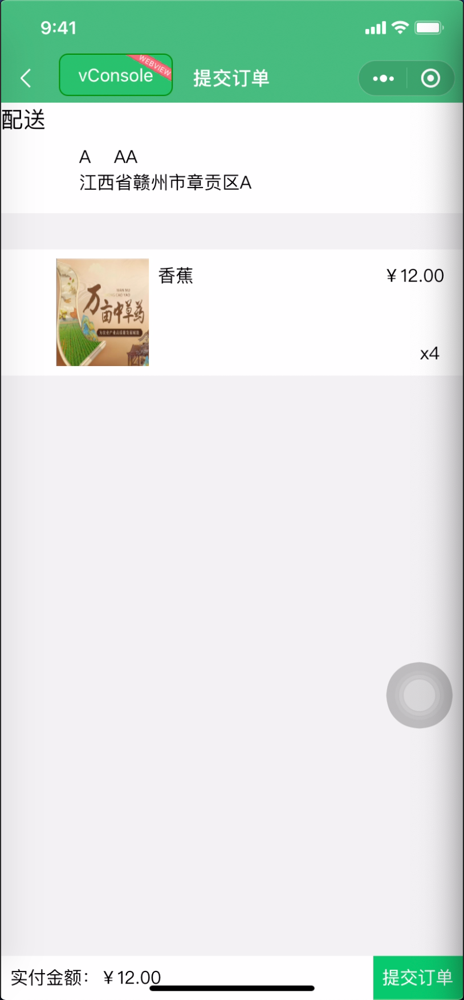

点击提交订单

点击选择、新建地址

### 商品列表展示

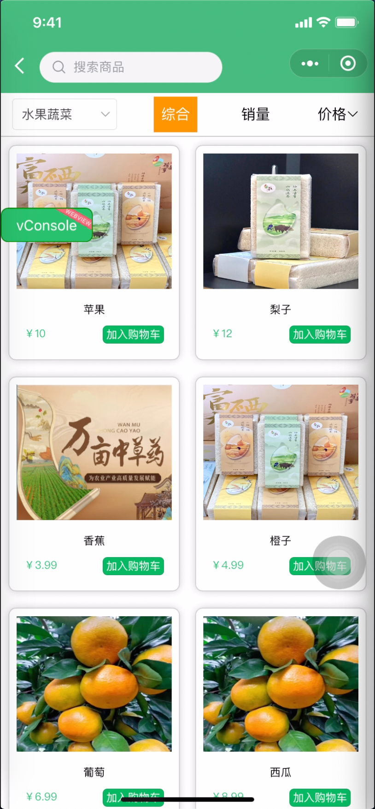

点击加入购物车

点击查看商品详情

点击依照对应排序

点击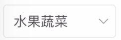选择商品类型

输入关键字点击搜索即可搜索相关内容

### 收货地址展示

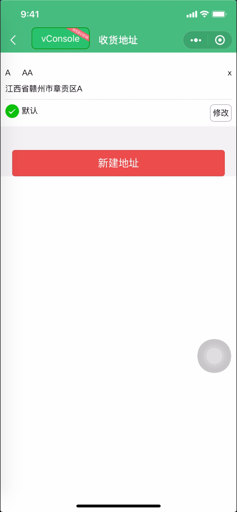

点击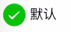切换默认地址

点击修改地址

点击删除地址

点击新建地址

### 就业展示

 
 
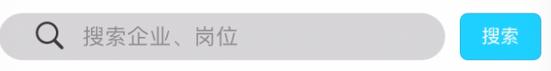

输入关键字点击搜索即可搜索相关内容

点击选项切换对应内容

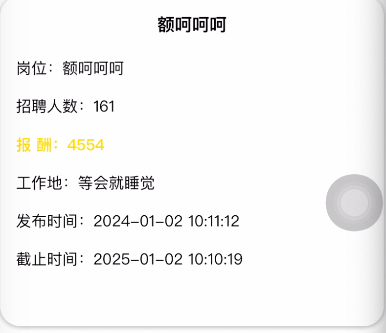

点击进入就业详情页面

点击进入发布招聘

### 管理员个人中心页展示

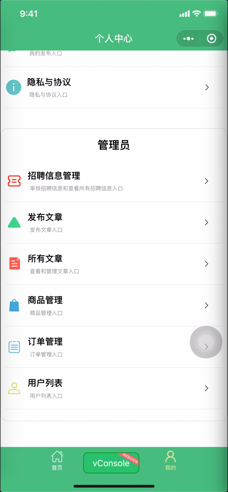

点击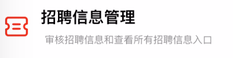审核用户发布招聘

点击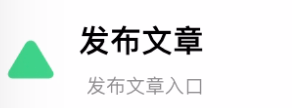发布文章

点击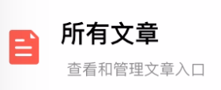查看、编辑文章列表

点击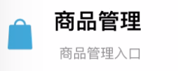查看、编辑商品列表

点击查看、编辑订单列表

点击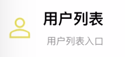查看用户列表、添加管理员

### 管理员商品列表展示

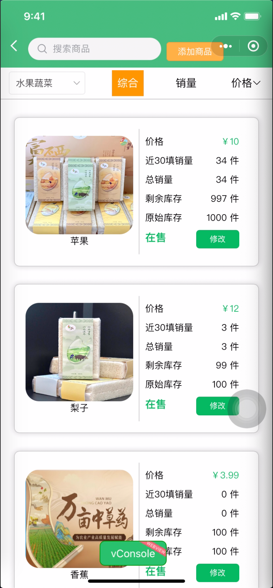

点击修改商品信息

点击添加商品

**注：本项目图片素材均来源于网络，仅供学习使用。**
